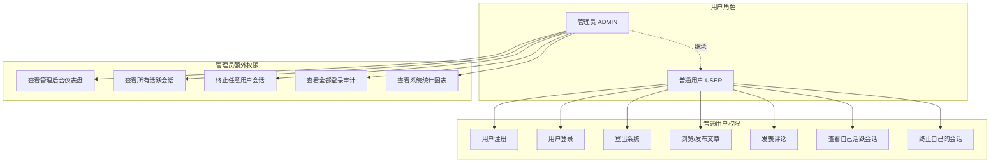
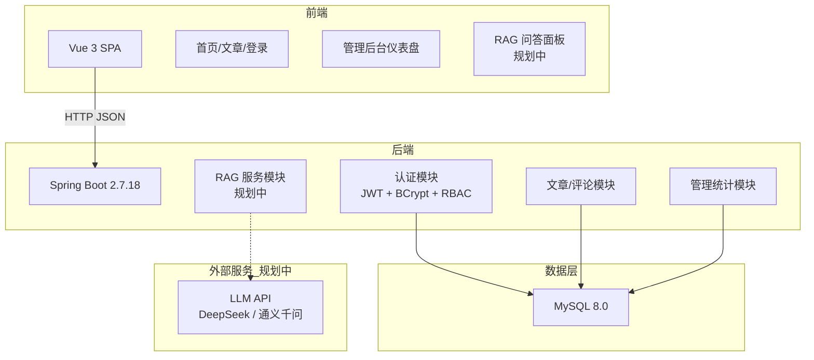
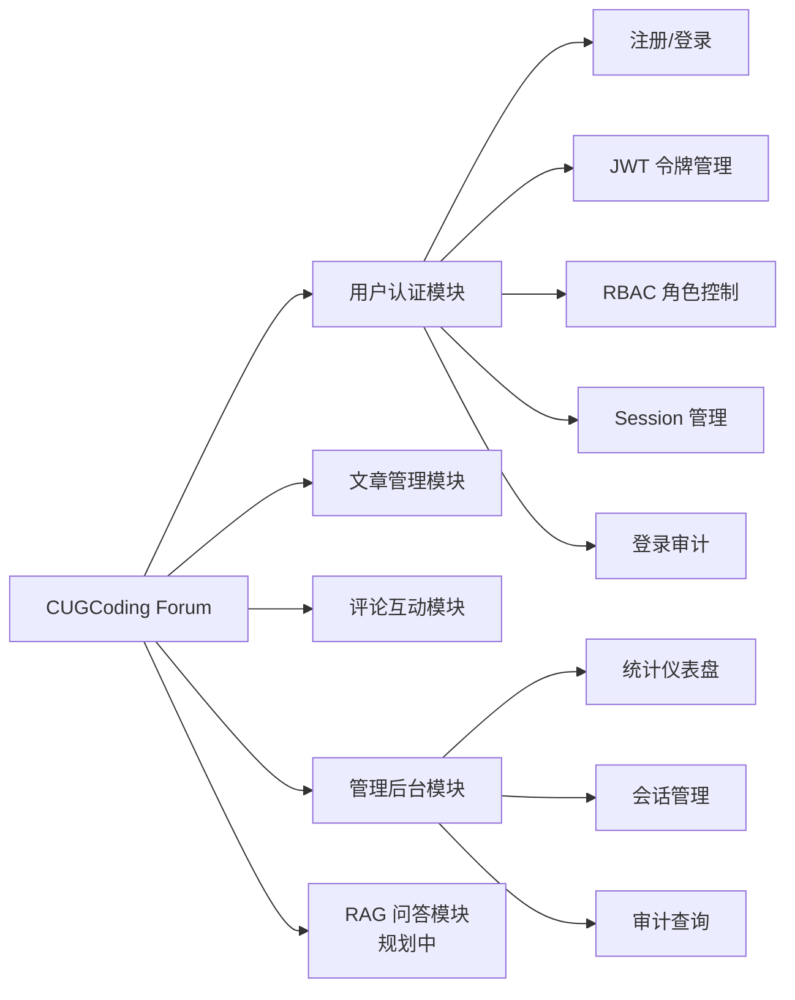
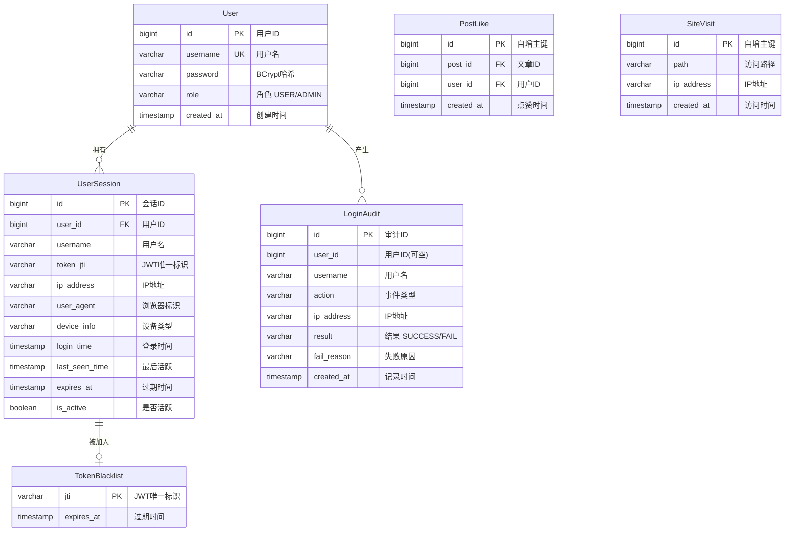
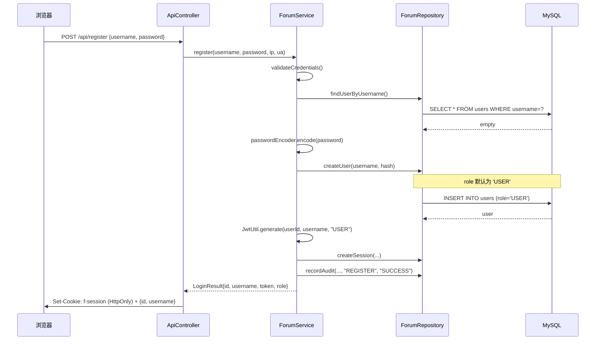
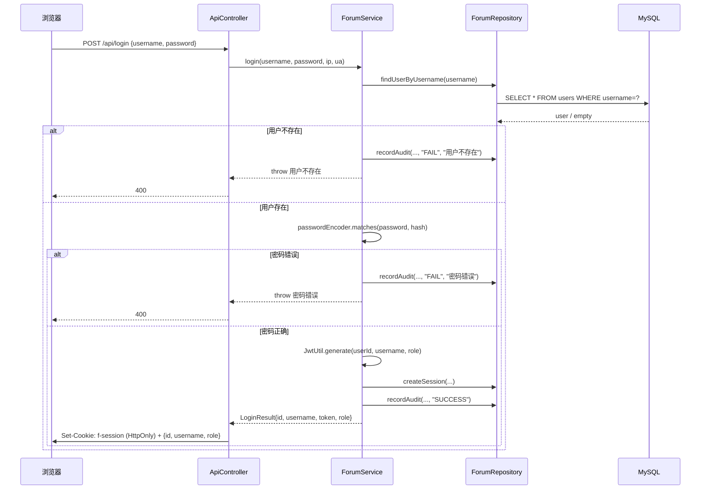
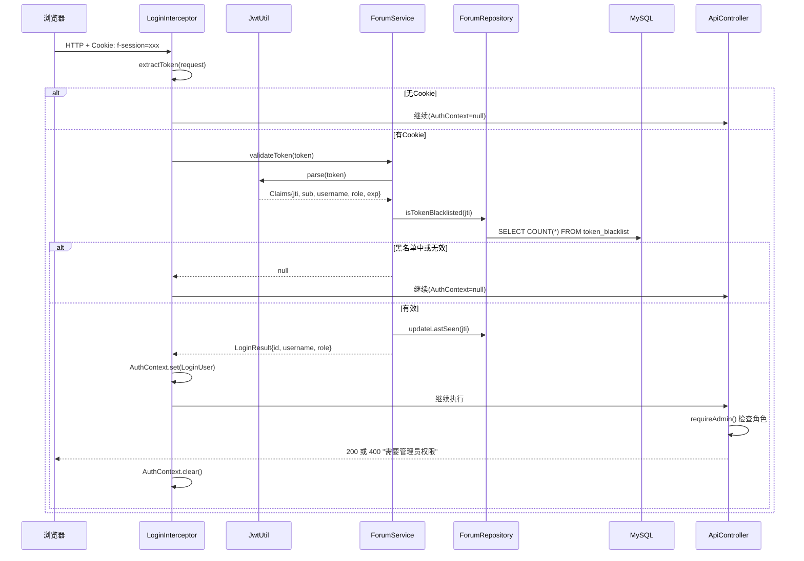

# 基于RAG增强的校园学习交流论坛的设计与实现 —— 用户认证模块


## 摘要

随着互联网技术在高等教育领域的深入应用，校园信息化建设已成为提升教学质量和管理效率的重要手段。传统的校园论坛系统虽然能提供基本的内容发布与讨论功能，但普遍缺乏智能化的知识检索与辅助学习能力。本文设计并实现了一款融合检索增强生成（Retrieval-Augmented Generation, RAG）技术的校园学习交流论坛系统。系统采用前后端分离架构，前端基于 Vue 3 和 Vite 构建单页应用，后端基于 Spring Boot 2.7.18 和 JDBC Template 构建 RESTful API，数据持久化使用 MySQL 8.0 关系型数据库。系统的创新点在于：用户可以选择多篇感兴趣的论坛文章，通过 RAG 技术让 AI 助手基于这些文章的内容进行智能问答，帮助用户深入理解文章中的技术知识。

本文重点阐述用户认证模块的完整设计与实现过程。系统设定了普通用户（USER）和管理员（ADMIN）两种角色，实现了基于角色的访问控制（RBAC）。认证模块采用 JWT（JSON Web Token）结合 HttpOnly Cookie 的无状态认证方案，使用 BCrypt 算法进行密码单向哈希存储，通过 LoginInterceptor 拦截器实现统一的请求级身份校验，并基于 AuthContext 线程局部变量实现用户上下文注入。在此基础上，系统设计了 Session 元数据管理机制，通过 `user_sessions` 表记录用户登录设备和活跃时间等信息，支持多设备会话追踪和远程会话终止。同时，系统实现了登录审计功能，并将审计数据通过管理后台以可视化图表形式展示。管理后台采用 Chart.js 构建交互式数据仪表盘，提供文章阅读量排行榜、点赞量排行榜、活跃会话管理和审计日志查询等功能，仅管理员可访问。

测试阶段采用 JUnit 5 + MockMvc 进行单元测试，并通过 curl 和 MySQL 命令行工具进行端到端集成测试。36 项自动化测试用例全部通过，验证了认证模块的功能正确性、安全性以及基于角色的权限控制。

**关键词**：校园论坛；RAG；Spring Boot；JWT 认证；BCrypt 加密；RBAC；管理后台；数据可视化


## Abstract

With the deepening application of Internet technology in higher education, campus informatization has become an important means to improve teaching quality and management efficiency. While traditional campus forum systems provide basic content publishing and discussion capabilities, they generally lack intelligent knowledge retrieval and assisted learning features. This thesis designs and implements a campus learning exchange forum system integrating Retrieval-Augmented Generation (RAG) technology. The system adopts a front-end and back-end separation architecture, with the front-end built on Vue 3 and Vite and the back-end built on Spring Boot 2.7.18 and JDBC Template, with MySQL 8.0 for data persistence. The innovation of the system lies in its RAG capability: users can select multiple forum articles of interest, and the AI assistant will answer questions based on the content of these articles, helping users gain deeper understanding of technical knowledge discussed in the forum.

This thesis focuses on the complete design and implementation of the user authentication module. The system defines two roles — regular user (USER) and administrator (ADMIN) — and implements role-based access control (RBAC). The authentication module adopts a stateless authentication scheme combining JWT with HttpOnly cookies, uses BCrypt for one-way password hashing, implements unified request-level identity verification through a LoginInterceptor, and injects user context via AuthContext thread-local variables. The system also implements a session metadata management mechanism recording login device and activity information through the `user_sessions` table, supporting multi-device tracking and remote session termination. Additionally, login audit data is visualized through an admin dashboard built with Chart.js, featuring interactive charts for daily login trends and device distribution, as well as session management and audit log querying — all accessible only to administrators.

In the testing phase, 36 automated test cases were executed using JUnit 5 and MockMvc, and end-to-end integration tests were conducted using curl and MySQL command-line tools. All tests passed, verifying functional correctness, security, and role-based access control of the authentication module.

**Keywords**: Campus Forum; RAG; Spring Boot; JWT Authentication; BCrypt Encryption; RBAC; Admin Dashboard; Data Visualization

---

## 第1章 绪论

### 1.1 课题背景

随着信息技术的飞速发展，互联网已深度融入高校学生的日常学习和生活。当前，高校学生面临着课程学习、社团活动、学术交流、求职准备等多方面的信息需求。然而，现有的校园信息传播渠道——如微信群、QQ群、校内通知栏等——存在信息碎片化严重、内容难以沉淀、检索不便等问题。学生在这些平台上提出的技术问题往往被聊天流淹没，有价值的经验分享无法被后来的同学检索利用。

与此同时，大语言模型（Large Language Model, LLM）技术的突破为知识获取方式带来了革命性变化。检索增强生成（RAG）技术通过将外部知识库与 LLM 结合，能够基于特定文档内容进行精准的问答，有效解决了 LLM 的"幻觉"问题和知识时效性问题。将 RAG 技术引入校园论坛，让学生能够针对论坛中的文章内容向 AI 提问，可以显著提升学习效率和知识吸收深度。

在此背景下，设计并实现一个融合 RAG 智能问答能力的校园学习交流论坛，既具备传统论坛的内容沉淀和社区互动优势，又提供了 AI 辅助的智能化学习体验，具有明确的现实需求和技术可行性。

### 1.2 课题意义

本课题的意义体现在以下四个方面：

**（1）服务校园学习交流。** 论坛为在校学生提供一个集中式的知识分享与讨论平台。学生可以在论坛中发布学习笔记、技术教程、校园活动信息；可以通过评论进行互动讨论；可以按专栏分类浏览感兴趣的内容。论坛内容的持久化和可检索性弥补了即时通讯工具在知识沉淀方面的不足。

**（2）引入 RAG 技术创新点。** 传统的校园论坛功能较为单一，本文通过在论坛中集成 RAG 智能问答功能，使用户能够基于选中的文章内容向 AI 提问，获取针对性的知识解答。这一创新点使本课题区别于常规的论坛毕业设计，体现了对前沿技术的探索和应用。

**（3）实践现代 Web 开发技术。** 本项目的开发过程涵盖了前后端分离架构设计、RESTful API 设计、数据库建模、用户认证与安全防护、基于角色的访问控制（RBAC）、数据可视化等现代 Web 开发的核心技术领域。管理后台采用 Chart.js 构建交互式图表，展示系统运行的关键指标。

**（4）体现计算机专业综合能力。** 毕业设计是计算机专业学生综合运用所学知识解决实际工程问题的重要环节。本课题从需求分析、系统设计、编码实现到测试验证，完整地覆盖了软件工程的生命周期，是对本科阶段学习成果的全面检验。

### 1.3 国内外研究现状

论坛系统作为互联网最早的应用形态之一，经历了从 Usenet 新闻组到 Web 论坛再到移动社区的演进过程。

**论坛系统方面**，Discuz 长期占据中文论坛市场的主导地位，但其基于 PHP + MySQL 的传统架构在高并发和移动端体验方面存在局限。Discourse、Flarum 等现代论坛系统采用前端渲染、实时通知、Markdown 编辑器等新特性，显著改善了用户体验。掘金、SegmentFault 等技术社区平台在国内技术圈广泛流行，它们强调内容质量、专栏分类和个性化推荐。

**RAG 技术方面**，自 2020 年 Lewis 等人提出 RAG 概念以来，该技术已广泛应用于智能客服、知识库问答、文档分析等领域。RAG 的核心思想是在 LLM 生成回答之前，先从外部知识库中检索相关文档片段，将其作为上下文注入 Prompt，使模型能够基于最新、最相关的信息进行回答。这种方式有效缓解了 LLM 的知识截止限制和幻觉问题。

**Web 认证技术方面**，前后端分离已成为公认的最佳实践。JWT 结合 OAuth 2.0 的 Token 认证方案被广泛采用，逐步替代传统的基于 Session 的有状态认证。基于角色的访问控制（RBAC）是业界成熟的安全模型，通过将权限赋予角色而非直接赋予用户，简化了权限管理。

### 1.4 主要工作

本项目主要完成了以下工作：

1. **前后端分离架构搭建**：基于 Vue 3 + Vite 构建前端 SPA，基于 Spring Boot 2.7.18 构建后端 RESTful API，前后端通过 HTTP + JSON 进行通信。

2. **用户认证体系设计与实现**：采用 JWT + HttpOnly Cookie 的无状态认证方案，集成 BCrypt 密码哈希，实现 LoginInterceptor 统一请求鉴权，设计了普通用户（USER）和管理员（ADMIN）两种角色，实现了基于角色的访问控制。

3. **Session 管理与登录审计**：设计了 `user_sessions` 表和 `login_audit` 表，实现了多设备登录追踪、活跃时间刷新、远程会话终止等功能。

4. **管理后台可视化**：基于 Chart.js 构建了管理后台仪表盘，展示用户总数、文章数、文章阅读量/点赞量排行等统计信息，并提供活跃会话管理和审计日志查询功能。

5. **论坛核心功能开发**：实现了文章发布、文章列表、文章详情、评论发布等论坛基础功能。

6. **全面的测试验证**：编写了 36 项单元测试用例，执行了端到端集成测试，覆盖核心功能、安全边界和权限控制。

### 1.5 论文结构

本文共分为六章：

- 第1章 绪论：介绍课题背景、意义、研究现状和主要工作。
- 第2章 系统需求分析：分析可行性，提炼功能需求（含 RAG 模块规划）、角色需求和非功能需求。
- 第3章 系统概要设计：阐述系统整体架构、功能模块划分、数据库概念设计和技术选型。
- 第4章 系统详细设计：详细描述认证流程、JWT 设计、BCrypt 加密、RBAC 角色控制、Session 管理和管理后台设计。
- 第5章 系统实现与测试：展示核心代码实现、管理后台界面、测试方案和结果。
- 第6章 总结与展望：总结已完成工作，展望后续优化方向和 RAG 模块计划。

---

## 第2章 系统需求分析

### 2.1 可行性分析

#### 2.1.1 技术可行性

本系统采用的技术栈均为成熟稳定的开源技术。Spring Boot 是 Java 生态中最流行的微服务开发框架。Vue 3 是当前主流的前端框架之一。MySQL 8.0 是业界广泛使用的关系型数据库。JWT 和 BCrypt 均为经过工业界充分验证的安全技术方案。Chart.js 是轻量级的开源图表库，支持折线图、饼图、柱状图等多种图表类型。RAG 技术方面，LangChain、LlamaIndex 等开源框架已提供了成熟的 RAG 实现方案。所有技术组件均可免费获取，技术风险可控。

#### 2.1.2 经济可行性

系统开发所需的开发工具（IntelliJ IDEA 社区版、VS Code）、运行环境（JDK 1.8、Node.js、MySQL）、第三方库均为开源免费软件。系统部署仅需一台配置普通的服务器即可运行，经济成本极低。

#### 2.1.3 操作可行性

系统用户界面采用简洁的卡片式布局，交互流程符合主流 Web 应用的通用习惯。管理后台仪表盘提供直观的数据可视化图表，管理员无需专业技术培训即可使用。

### 2.2 角色需求

系统设定了两种用户角色，不同角色具有不同的操作权限：

**表2-1 系统角色定义**

| 角色 | 标识 | 权限说明 |
|------|------|---------|
| 普通用户 | USER | 注册、登录、查看文章、发布文章、发表评论、查看个人信息、管理自己的会话 |
| 管理员 | ADMIN | 拥有普通用户的全部权限，此外：查看系统统计信息、查看所有用户的活跃会话、终止任意会话、查看全部登录审计日志 |



**图2-1 系统角色与权限用例图**

### 2.3 功能需求

#### 2.3.1 用户认证模块

用户认证模块是论坛系统的基础模块，为其他所有功能提供身份识别和访问控制服务。

**表2-2 用户注册用例描述**

| 项目 | 内容 |
|------|------|
| 用例名称 | 用户注册 |
| 参与者 | 普通用户（未登录） |
| 前置条件 | 用户名未被注册 |
| 后置条件 | 创建用户记录（role=USER），签发 JWT（含角色信息），设置 Cookie，记录 Session 和审计 |
| 基本流程 | 1. 用户输入用户名和密码 2. 系统校验用户名唯一性 3. BCrypt 加密密码 4. 生成含角色声明的 JWT 5. 写入 HttpOnly Cookie 6. 返回用户信息 |
| 异常流程 | 用户名已存在 → 400 "用户名已存在"；输入为空 → 400 参数校验错误 |

**表2-3 用户登录用例描述**

| 项目 | 内容 |
|------|------|
| 用例名称 | 用户登录 |
| 参与者 | 普通用户/管理员（未登录） |
| 前置条件 | 用户已注册 |
| 后置条件 | 签发含角色声明的 JWT，设置 Cookie，记录 Session 和审计 |
| 基本流程 | 1. 用户输入用户名和密码 2. BCrypt 验证密码 3. 生成 JWT 4. 写入 Cookie 5. 返回用户信息（含角色） |
| 异常流程 | 用户不存在 → 400 "用户不存在"；密码错误 → 400 "密码错误"，记录审计失败 |

**表2-4 管理后台用例描述**

| 项目 | 内容 |
|------|------|
| 用例名称 | 管理员访问后台仪表盘 |
| 参与者 | 管理员 |
| 前置条件 | 已登录且角色为 ADMIN |
| 后置条件 | 展示系统统计数据和可视化图表 |
| 基本流程 | 1. 管理员点击导航栏"管理后台" 2. 系统验证角色 3. 加载统计数据 4. 渲染折线图和饼图 5. 展示活跃会话和审计日志 |
| 异常流程 | 普通用户访问 → 400 "需要管理员权限" |

#### 2.3.2 帖子与评论模块（已实现基础功能）

- 文章发布：已登录用户可使用 Markdown 编辑器撰写和发布文章。
- 文章列表：首页展示所有已发布文章，支持查看详情。
- 文章详情：展示文章 Markdown 渲染后的内容，以及相关评论。
- 评论功能：已登录用户可以在文章详情页发表评论。

#### 2.3.3 RAG 智能问答模块（规划中）

RAG 模块是系统的核心创新点。用户可以在文章列表中选择多篇感兴趣的文章，提交一个问题，系统将自动检索所选文章的文本内容，将相关片段作为上下文提供给 LLM（如 DeepSeek、通义千问等），由 LLM 基于文章内容生成回答。

**表2-5 RAG 模块规划用例**

| 项目 | 内容 |
|------|------|
| 用例名称 | 基于选定文章的 AI 问答 |
| 参与者 | 已登录用户 |
| 前置条件 | 系统中存在已发布的文章 |
| 基本流程 | 1. 用户勾选多篇文章 2. 输入自然语言问题 3. 系统检索文章内容，构建 RAG Prompt 4. 调用 LLM API 5. 返回引用来源的回答 |
| 后续工作 | 将于后续迭代中实现 |

### 2.4 非功能需求

#### 2.4.1 安全性需求

1. **密码安全**：使用 BCrypt 单向哈希存储，每次加密使用不同随机盐值。
2. **令牌安全**：JWT 使用 HMAC-SHA512 签名，有效期 7 天，支持黑名单主动失效。
3. **角色权限**：管理员专属接口（`/api/admin/**`）必须验证用户角色为 ADMIN，普通用户无法访问。
4. **Cookie 安全**：Cookie 设置 HttpOnly 标记，防止 XSS 攻击。
5. **密码不可泄露**：API 响应不包含 password 字段。

#### 2.4.2 性能需求

1. 认证接口响应时间不超过 500ms。
2. 鉴权拦截器开销最小化（JWT 验签不查库）。
3. 统计数据查询支持按天聚合。

#### 2.4.3 可维护性需求

1. 认证逻辑集中在 `auth` 包，角色校验逻辑集中在 `AuthContext` 类。
2. 数据库表通过 `initSchema()` 自动创建和迁移。
3. 提供完整的单元测试，覆盖普通用户和管理员两种角色。

---

## 第3章 系统概要设计

### 3.1 系统整体架构

系统采用前后端分离架构。前端是基于 Vue 3 的单页应用，后端是基于 Spring Boot 2.7.18 的 RESTful API 服务。数据层使用 MySQL 8.0。未来 RAG 模块将对接 LLM API（如 DeepSeek、通义千问等）。



**图3-1 系统整体架构图**

### 3.2 功能模块划分



**图3-2 系统功能模块图**

### 3.3 数据库概念设计

认证模块涉及的核心实体包括：用户（User）、用户会话（UserSession）、登录审计（LoginAudit）和令牌黑名单（TokenBlacklist）。用户通过 `role` 字段区分普通用户和管理员。



**图3-3 认证模块 E-R 图**

### 3.4 技术选型

**表3-1 技术选型一览**

| 层次 | 技术 | 版本 | 选型理由 |
|------|------|------|---------|
| 后端框架 | Spring Boot | 2.7.18 | 主流微服务框架，自动配置，内嵌 Tomcat |
| 开发语言 | Java | 1.8 | 毕业设计目标版本 |
| 数据访问 | JDBC Template | — | Spring 内置，轻量级 |
| 数据库 | MySQL | 8.0 | 最广泛使用的关系型数据库 |
| JWT 库 | io.jsonwebtoken (jjwt) | 0.11.5 | 纯 Java 实现，支持 HMAC-SHA512 |
| 密码加密 | spring-security-crypto | — | Spring 生态 BCrypt 实现 |
| 前端框架 | Vue 3 | 3.5.13 | Composition API，组件化开发 |
| 构建工具 | Vite | 6.2.5 | 极速冷启动，HMR 热更新 |
| HTTP 客户端 | Axios | 1.8.4 | Promise 风格，支持 Cookie 自动携带 |
| Markdown | md-editor-v3 | 6.4.2 | 实时预览编辑器 |
| 图表库 | Chart.js | 4.4.7 | 轻量级，支持折线/饼图/柱状图 |
| RAG（规划） | LangChain / LlamaIndex | — | 成熟的 RAG 框架 |

---

## 第4章 系统详细设计

### 4.1 认证流程设计

#### 4.1.1 用户注册流程

注册时，系统自动为新用户分配 USER 角色。JWT 令牌中包含角色声明（claim），确保前端和后端均可获取用户角色。



**图4-1 用户注册流程时序图**

#### 4.1.2 用户登录流程



**图4-2 用户登录流程时序图**

#### 4.1.3 请求鉴权流程



**图4-3 请求鉴权流程时序图**

### 4.2 JWT 令牌设计

JWT 的 Payload 结构如下。其中 `role` 声明是 RBAC 实现的关键——前端根据此字段决定是否显示管理后台入口，后端根据此字段决定是否允许访问管理员接口。

```json
{
  "jti": "aee3e046-7120-4f4c-9609-a5e6a01007c4",
  "iss": "cugcoding-forum",
  "sub": "1",
  "username": "admin",
  "role": "ADMIN",
  "iat": 1777527042,
  "exp": 1778131842
}
```

| 字段 | 说明 |
|------|------|
| jti | JWT ID（UUID），用于黑名单和 Session 关联 |
| iss | 签发者 "cugcoding-forum" |
| sub | 用户 ID |
| username | 用户名 |
| role | 角色（USER / ADMIN），RBAC 核心声明 |
| iat | 签发时间 |
| exp | 过期时间（+7天） |

签名算法：HMAC-SHA512，密钥长度 256 bits。

### 4.3 RBAC 角色访问控制设计

基于角色的访问控制（RBAC）是本系统权限管理的核心机制。系统通过以下三个层次实现角色验证：

**（1）JWT 声明层**：角色信息在登录/注册时写入 JWT 的 `role` 声明，随令牌一起传输。

**（2）AuthContext 上下文层**：`LoginInterceptor` 在解析 JWT 后将角色注入 `AuthContext.LoginUser`，Controller 层通过该方法获取当前用户的角色信息。

**（3）API 校验层**：管理员专属接口调用 `AuthContext.requireAdmin()` 进行角色校验，非管理员访问时返回 400 "需要管理员权限"。

受管理员权限保护的接口：

| 接口 | 功能 | 权限 |
|------|------|------|
| GET /api/admin/stats | 获取系统统计数据 | ADMIN |
| GET /api/admin/sessions | 查看所有活跃会话 | ADMIN |
| POST /api/admin/sessions/{jti}/terminate | 终止任意会话 | ADMIN |
| GET /api/admin/audits | 查看所有审计日志 | ADMIN |

### 4.4 BCrypt 密码加密

使用 Spring Security Crypto 的 `BCryptPasswordEncoder`，工作因子为默认值 10。

**BCrypt 哈希的构成**：`encode()` 方法每次执行都会生成一个 16 字节的随机盐值，并将盐值、工作因子和哈希结果拼接为一个固定格式的字符串。典型的 BCrypt 哈希格式为：

```text
$2a$10$N9qo8uLOickgx2ZMRZoMyeIjZAgcfl7p92ldGxad68LJZdL17lhWy
 |  |  |_____________________|_____________________________|
 |  |        22字符随机盐               31字符哈希值
 |  工作因子=2^10=1024轮迭代
 算法标识(2a=BCrypt)
```

**`matches()` 验证原理**：当调用 `matches("明文密码", "存储的哈希")` 时，BCrypt 从存储的哈希字符串中提取出盐值（上例中的 `N9qo8uLOickgx2ZMRZoMye`），然后用相同的盐值和工作因子对输入的明文密码重新进行哈希计算，最后比较新生成的哈希值与存储的哈希值是否一致。由于相同的盐值 + 相同的明文 → 相同的哈希结果，因此验证能够成功，而无需在数据库中单独存储盐值。

举例说明：对密码 `"test123"` 连续调用两次 `encode()`，会得到两个完全不同的哈希值（因为使用了不同的随机盐）：

```text
$2a$10$A1b2C3d4E5f6G7h8I9j0K.OxPqRsTuVwXyZaBcDeFgHiJkLmNoPq  (盐值: A1b2C3d4E5f6G7h8I9j0K.)
$2a$10$Z9y8X7w6V5u4T3s2R1q0P.AbCdEfGhIjKlMnOpQrStUvWxYz1234  (盐值: Z9y8X7w6V5u4T3s2R1q0P.)
```

尽管两个哈希值完全不同，但 `matches("test123", 哈希1)` 返回 `true`，`matches("test123", 哈希2)` 也返回 `true`，而 `matches("wrong", 哈希1)` 返回 `false`。这正是因为 `matches()` 会从每个哈希中提取其自带的盐值来验证，从而实现了"同一密码每次加密结果不同，但都能通过验证"的安全特性。这也意味着即使数据库被泄露，攻击者无法通过观察哈希值是否相同来判断两个用户是否使用了相同密码。

### 4.5 Session 管理设计

`user_sessions` 表记录每次登录的元数据，核心字段包括：token_jti（关联 JWT）、ip_address、user_agent、device_info（设备类型识别）、login_time、last_seen_time（每次请求刷新）、is_active（登出/被踢后置 FALSE）。

设备类型识别通过解析 User-Agent 实现，IP 获取采用 X-Forwarded-For → X-Real-IP → RemoteAddr 的多级回退策略。

### 4.6 管理后台数据统计设计

管理后台仪表盘通过聚合查询从 `user_sessions`、`login_audit` 等表中提取统计数据：

- **基础统计**：用户总数、文章总数、评论总数、活跃会话数、近 7 天失败登录次数
- **每日登录趋势**：按天聚合 login_audit 表，统计成功/失败登录数，用于折线图展示
- **设备分布**：按 device_info 分组统计活跃会话数，用于饼图展示
- **活跃会话列表**：查询所有 is_active=TRUE 的会话记录，支持管理员踢出操作
- **审计日志**：按时间倒序查询所有认证事件

为支持文章阅读和点赞统计、网站访问量统计，系统增设了以下辅助表：

- **post_likes 表**：记录用户对文章的点赞关系，通过唯一约束 uk_post_user 保证同一用户对同一文章只能点赞一次。点赞时计数器加一，取消点赞时计数器减一。
- **site_visits 表**：记录每次页面访问的路径和 IP 地址，通过 `POST /api/visits` 端点由前端主动上报，后台统计聚合得到网站总访问量。
- **posts 表新增字段**：`view_count` 和 `like_count` 两个计数器字段，每次文章查看和点赞/取消操作同步更新。

管理后台的文章排行榜通过 `ORDER BY view_count/view_count DESC` 查询直接获取 Top 10 热门文章，配合 Chart.js 的水平柱状图展示。

### 4.7 数据库物理设计

**表4-1 users（用户表）**

| 字段 | 类型 | 约束 | 说明 |
|------|------|------|------|
| id | BIGINT | PK, AUTO_INCREMENT | 用户 ID |
| username | VARCHAR(50) | NOT NULL, UNIQUE | 用户名 |
| password | VARCHAR(200) | NOT NULL | BCrypt 哈希 |
| role | VARCHAR(20) | NOT NULL, DEFAULT 'USER' | 角色 |
| created_at | TIMESTAMP | DEFAULT CURRENT_TIMESTAMP | 创建时间 |

**表4-2 posts 表新增字段（文章数据分析）**

| 字段 | 类型 | 默认值 | 说明 |
|------|------|--------|------|
| view_count | BIGINT | 0 | 文章阅读次数，每次查看文章详情自增 |
| like_count | BIGINT | 0 | 文章获赞次数，与 post_likes 表联动更新 |

**表4-3 post_likes（点赞关系表）**

| 字段 | 类型 | 约束 | 说明 |
|------|------|------|------|
| id | BIGINT | PK, AUTO_INCREMENT | 主键 |
| post_id | BIGINT | NOT NULL | 文章ID |
| user_id | BIGINT | NOT NULL | 用户ID |
| created_at | TIMESTAMP | DEFAULT CURRENT_TIMESTAMP | 点赞时间 |
| | | UNIQUE(post_id, user_id) | 防重复点赞 |

**表4-4 site_visits（网站访问记录表）**

| 字段 | 类型 | 说明 |
|------|------|------|
| id | BIGINT | PK, AUTO_INCREMENT |
| path | VARCHAR(200) | 访问路径（如 `/api/posts/1`） |
| ip_address | VARCHAR(45) | 访问者IP地址 |
| created_at | TIMESTAMP | DEFAULT CURRENT_TIMESTAMP |

其余表结构（user_sessions、login_audit、token_blacklist）同第3章 E-R 图所述，此处不再重复。

---

## 第5章 系统实现与测试

### 5.1 核心功能实现

#### 5.1.1 RBAC 角色令牌生成

`JwtUtil.generate()` 方法接收 userId、username 和 role 三个参数，将 role 作为自定义声明写入 JWT：

```java
public static String generate(Long userId, String username, String role) {
    Date now = new Date();
    return Jwts.builder()
            .setId(UUID.randomUUID().toString())
            .setIssuer("cugcoding-forum")
            .setSubject(String.valueOf(userId))
            .claim("username", username)
            .claim("role", role)        // RBAC 核心声明
            .setIssuedAt(now)
            .setExpiration(new Date(now.getTime() + EXPIRE_MS))
            .signWith(KEY)
            .compact();
}
```

#### 5.1.2 角色校验拦截

`AuthContext` 类提供 `requireLogin()` 和 `requireAdmin()` 两个静态方法，Controller 层通过调用这些方法实现统一的身份和权限校验：

```java
public static void requireAdmin() {
    LoginUser user = get();
    if (user == null) throw new IllegalArgumentException("请先登录");
    if (!user.isAdmin()) throw new IllegalArgumentException("需要管理员权限");
}
```

管理员在数据库中存储为 `role='ADMIN'`，系统启动时自动创建。若已有 admin 用户但角色为 USER，系统会自动将其升级为 ADMIN。

#### 5.1.3 前端 RBAC 表现

前端通过 `/api/me` 接口获取当前用户角色，根据角色决定是否显示"管理后台"导航链接：

- 管理员登录后，导航栏显示橙色"管理后台"链接
- 普通用户登录后，导航栏不显示该链接
- 即使普通用户手动访问 `/admin` 路由，后端 API 也会因角色校验而拒绝返回数据


**图5-1 登录页面**


**图5-2 注册成功后首页**


**图5-3 文章发布页面**


**图5-4 文章详情与评论区**

#### 5.1.4 管理后台仪表盘

管理后台使用 Chart.js 构建。页面包含：

- **统计卡片**：用户总数、文章总数、评论总数、网站总访问量、当前在线会话数、近 7 天失败登录次数
- **文章阅读量排行**（水平柱状图）：按 `view_count` 降序展示 Top 10 热门文章
- **文章点赞量排行**（水平柱状图）：按 `like_count` 降序展示 Top 10 最受欢迎文章
- **活跃会话管理表**：支持管理员查看所有用户会话并踢出指定会话
- **审计日志表**：展示所有认证事件，支持管理员模式切换全局/个人视图


**图5-5 管理后台仪表盘**


**图5-6 普通用户导航栏（无管理后台入口）**

### 5.2 测试

#### 5.2.1 测试环境

| 项目 | 配置 |
|------|------|
| JDK | 1.8.0_472 |
| Spring Boot | 2.7.18 |
| 单元测试框架 | JUnit 5 + MockMvc |
| 单元测试数据库 | H2 内存数据库（MODE=MySQL） |
| 集成测试数据库 | MySQL 8.0（Docker） |
| JWT 库 | jjwt 0.11.5 |
| 密码加密 | spring-security-crypto BCrypt |

#### 5.2.2 单元测试

**测试用例统计**：

| 测试类 | 用例数 | 通过 | 覆盖率 |
|--------|--------|------|--------|
| AuthSystemTests | 33 | 33 | 100% |
| ApiValidationTests | 1 | 1 | 100% |
| ForumServiceTests | 1 | 1 | 100% |
| ForumApplicationTests | 1 | 1 | 100% |
| **合计** | **36** | **36** | **100%** |

```
Tests run: 36, Failures: 0, Errors: 0, Skipped: 0
BUILD SUCCESS
```

**关键测试场景覆盖**：

1. **注册模块**（4项）：正常注册、重复用户名、空用户名、空密码
2. **登录模块**（3项）：正确密码、错误密码、用户不存在
3. **JWT 令牌**（5项）：生成/解析、篡改、空字符串、null、角色信息
4. **认证拦截器**（3项）：无 Cookie、有效 Cookie、受保护端点拒绝
5. **登出与黑名单**（2项）：登出 Cookie 清除、旧 Token 失效
6. **BCrypt 加密**（2项）：验证通过、盐值随机
7. **Session 管理**（6项）：多设备 Session、踢人、禁止操作他人 Session
8. **登录审计**（2项）：成功/失败记录
9. **RBAC 角色权限**（3项）：管理员专属接口拒绝普通用户、JWT 含角色声明、用户仅可见自己会话
10. **完整流程集成**（1项）：注册→登录→操作→登出→重新登录

#### 5.2.3 集成测试（API 端到端）

**（一）管理员登录与数据统计**

```text
$ curl -X POST http://localhost:8080/api/login \
  -H "Content-Type: application/json" \
  -d '{"username":"admin","password":"123456"}'
{"id":1,"username":"admin"}

$ curl http://localhost:8080/api/admin/stats -b cookies.txt
{"userCount":1,"postCount":3,"commentCount":0,
 "activeSessionCount":1,"failedLoginCount":0,
 "dailyLogins":[...],"sessionsByDevice":[...]}
```

**（二）普通用户被拒绝访问管理后台**

```text
$ curl http://localhost:8080/api/admin/stats -b user_cookies.txt
{"error":"Bad Request","message":"需要管理员权限"}
```

**（三）管理员查看全部活跃会话**

```text
$ curl http://localhost:8080/api/admin/sessions -b admin_cookies.txt
[{"username":"admin","deviceInfo":"Windows PC","ipAddress":"0:0:...",
  "active":true,"loginTime":"...","lastSeenTime":"..."}]
```

**（四）数据库角色字段验证**

```text
mysql> SELECT id, username, role FROM users;
+----+----------+--------+
| id | username | role   |
+----+----------+--------+
|  1 | admin    | ADMIN  |
|  2 | student  | USER   |
+----+----------+--------+
```

#### 5.2.4 测试结论

用户认证模块的 36 项单元测试全部通过，集成测试覆盖了注册、登录、JWT 签发、角色验证、Session 管理、审计记录、管理后台权限控制等核心功能。测试验证了：

- **功能正确性**：所有认证接口按预期工作
- **RBAC 正确性**：普通用户无法访问管理员接口，JWT 角色声明正确传递
- **安全性**：BCrypt 哈希、JWT 防篡改、HttpOnly Cookie、黑名单失效
- **数据完整性**：Session 和审计记录正确写入，管理后台统计数据准确

---

## 第6章 总结与展望

### 6.1 工作总结

本文完成了 CUGCoding 校园学习交流论坛系统的整体架构设计和用户认证模块的完整实现与测试。主要成果如下：

1. **完成了前后端分离架构搭建**。前端基于 Vue 3 + Vite，后端基于 Spring Boot 2.7.18，实现了文章发布、列表、详情、评论等基础功能。

2. **设计并实现了完整的用户认证体系与 RBAC 权限控制**。设定了 USER 和 ADMIN 两种角色，JWT 令牌携带角色声明，AuthContext 提供统一的角色校验方法，管理后台接口仅对管理员开放。

3. **构建了管理后台数据仪表盘**。基于 Chart.js 实现折线图和饼图，展示用户统计、每日登录趋势、设备分布等关键指标，支持活跃会话管理（含踢人功能）和审计日志查询。

4. **实现了 Session 元数据管理和登录审计功能**。记录用户的登录设备、IP、活跃时间等信息，追踪所有认证事件。

5. **完成了全面的测试验证**。36 项单元测试全部通过，覆盖了认证模块的全部功能点和 RBAC 权限边界。

### 6.2 后续工作展望

1. **RAG 智能问答模块**：集成 LangChain 或 LlamaIndex 框架，实现文章选择 → 内容检索 → Prompt 构建 → LLM 调用 → 引用回答的完整 RAG 流程。这是本系统的核心创新点，将为传统校园论坛注入 AI 辅助学习能力。

2. **完善论坛功能**：增加专栏分类管理、文章分页与搜索、用户个人主页、文章点赞收藏、通知系统等。

3. **强化安全管理**：增加登录失败次数限制（防暴力破解）、验证码机制、CSRF Token 防护等。

4. **性能优化**：引入 Redis 缓存热点数据，对核心接口进行压力测试。

5. **前端优化**：增加加载骨架屏、错误边界处理、移动端响应式适配。

6. **扩展管理后台**：增加内容审核功能、用户管理功能、系统配置面板。

---

## 参考文献

[1] Craig Walls. Spring in Action (5th Edition)[M]. Manning Publications, 2018.

[2] M. Jones, J. Bradley, N. Sakimura. JSON Web Token (JWT). RFC 7519, IETF, 2015.

[3] Niels Provos, David Mazières. A Future-Adaptable Password Scheme[C]. USENIX Annual Technical Conference, 1999: 81-91.

[4] Patrick Lewis, Ethan Perez, et al. Retrieval-Augmented Generation for Knowledge-Intensive NLP Tasks[C]. NeurIPS, 2020.

[5] Evan You. Vue.js: The Progressive JavaScript Framework[J]. Communications of the ACM, 2020.

[6] Rod Johnson, Juergen Hoeller, et al. Spring Framework Reference Documentation[EB/OL]. https://docs.spring.io/spring-framework/reference/, 2023.

[7] 李刚. 轻量级Java EE企业应用实战（第5版）[M]. 电子工业出版社, 2018.

[8] Oracle Corporation. MySQL 8.0 Reference Manual[EB/OL]. https://dev.mysql.com/doc/refman/8.0/en/, 2023.

[9] Ravi S. Sandhu, et al. Role-Based Access Control Models[J]. IEEE Computer, 1996, 29(2): 38-47.

[10] OWASP Foundation. OWASP Top Ten Web Application Security Risks[EB/OL]. https://owasp.org/www-project-top-ten/, 2021.

---

## 致谢

在本毕业设计的完成过程中，我得到了指导教师的悉心指导和同学们的热心帮助。在此，向所有给予我支持和帮助的老师、同学和家人表示最诚挚的感谢。特别感谢开源社区提供的优秀技术框架和工具，为本项目的开发提供了坚实的技术基础。
